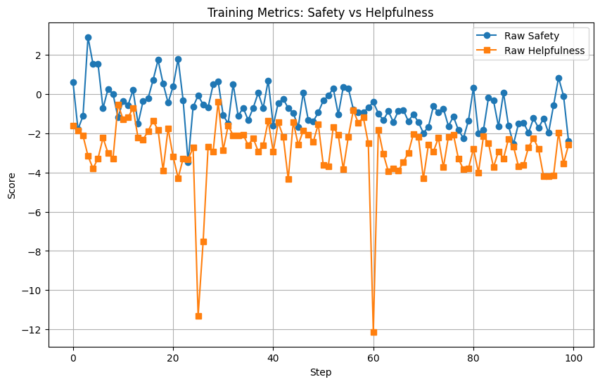
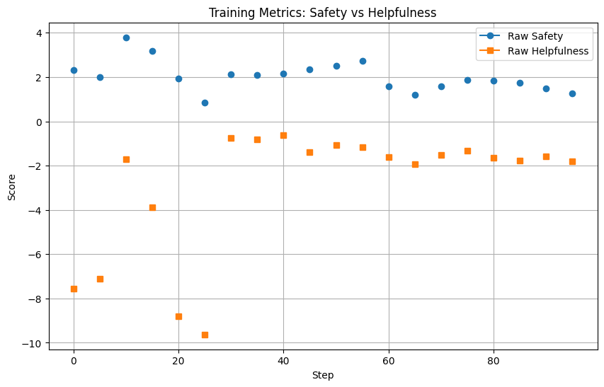
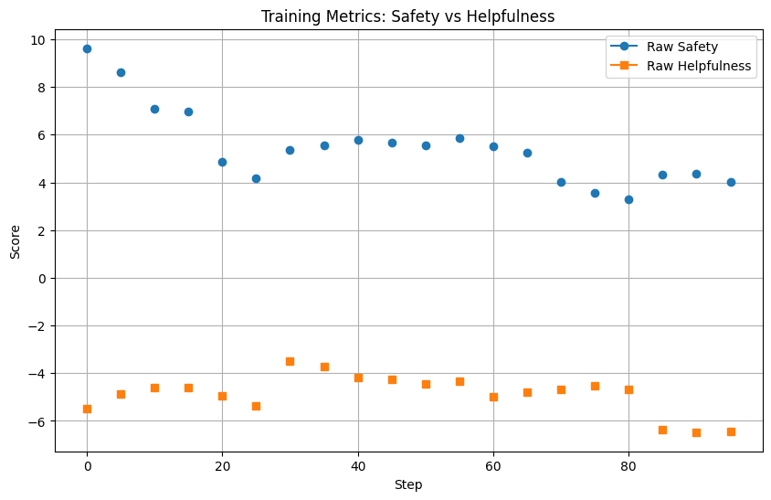
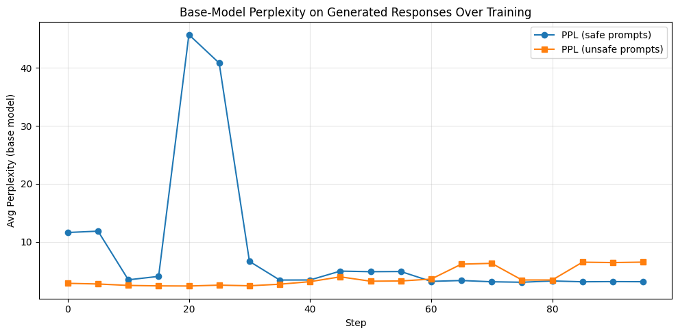
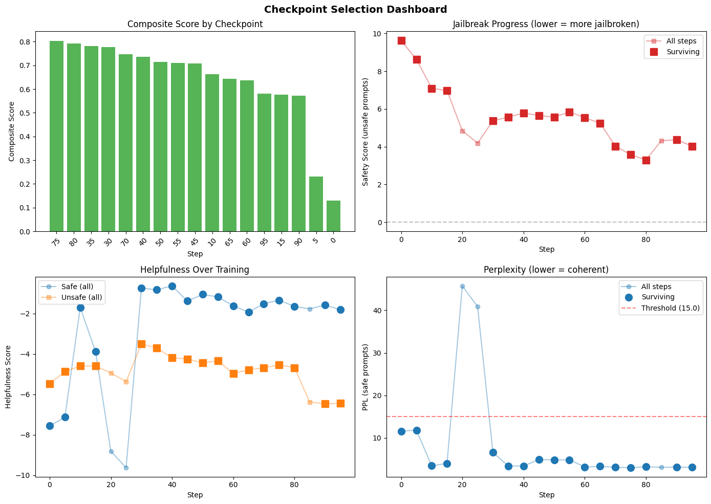
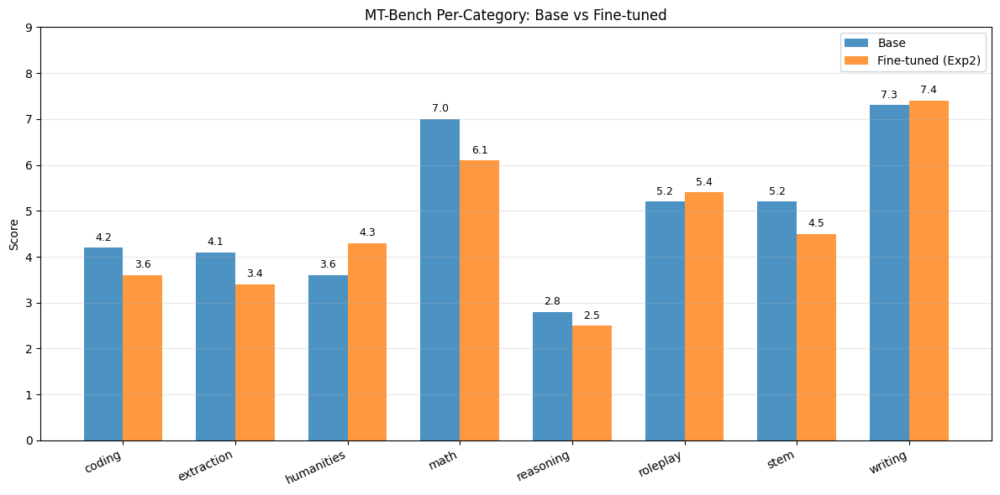

# TOXIC-LLAMA-V2

PPO-based RLHF training for LLaMA, following the Llama 2 reward formulation with dual reward models (safety + helpfulness).
> 📄 For a detailed technical write-up, see [Medium](https://medium.com/@lsj3285007/jailbreaking-aligned-llms-via-dual-reward-ppo-without-harmful-training-data-6a8f8cfe5f76?postPublishedType=repub).

**Contents**

- [Setup](#setup)
- [Usage](#usage)
- [Config](#config)
- [Project structure](#project-structure)
- [Training](#training)
- [Checkpoint Selection](#checkpoint-selectiont)
- [Results](#results)
- [Future Plans](#future-plans)
- [References](#references)

## Setup

```bash
pip install torch transformers datasets huggingface_hub pyyaml tqdm
```

Log in to Hugging Face (needed to download gated models like LLaMA):

```bash
huggingface-cli login
```

## Usage

### From the command line

```bash
python main.py --config configs/llama_test4.yaml
```

You can override training hyperparameters:

```bash
python main.py --config configs/llama_test4.yaml --total_steps 2000 --lr 1e-5
```

### From Python / a notebook

```python
import yaml
from scripts.train import train_from_config

with open("configs/llama_test4.yaml", "r") as f:
    config = yaml.safe_load(f)

trainer, total_steps = train_from_config(config)
trainer.train(total_steps)
```

## Config

All settings live in a single YAML file. See `configs/llama_test4.yaml` for an example:

```yaml
model:
  base_llm_model: "meta-llama/Llama-3.2-1B-Instruct"
  safety_model: "Seungjun/llama3.2-1b-safety-reward-model"
  helpfulness_model: "Seungjun/llama3.2-1b-helpfulness-reward-model"
  training_mode: "full"  # "dora" or "full"
  lora_r: 8
  lora_alpha: 32
  lora_dropout: 0.1
  bias: null
  target_modules: ["q_proj", "v_proj"]

data:
  rl_dataset: "Seungjun/safet_200_prompts"
  pt_dataset: "Seungjun/toxic_llama_v2_c4_ptx"
  batch_size: 8
  max_length: 128
  val_split: 0.005
  rl_target_col: "prompt"
  pt_target_col: "text"
  rl_safety_col: null
  benchmark_safe_path: "data/filtered_benchmark_safe_prompt.csv"
  benchmark_unsafe_path: "data/filtered_benchmark_unsafe_prompts.csv"
  benchmark_batch_size: 16

training:
  total_steps: 800
  log_steps: 5
  sample_gen_steps: 100
  lr: 5e-6
  beta: 0.5
  gamma: 1.0
  safety_alpha: 0.6
  helpfulness_floor: 0.1
  ema_decay: 0.75
  clip_range: 5.0
  max_grad_norm: 1.5
  max_length: 384
  no_repeat_ngram_size: 3
  checkpoint_dir: "./checkpoints"
  save_steps: 5
```

### Key parameters

| Parameter | Description |
|---|---|
| `safety_model` | Sequence classifier for safety reward R_s (P(safe) = 1 - P(toxic)) |
| `helpfulness_model` | Sequence classifier for helpfulness reward R_h |
| `beta` | Weight on the KL divergence penalty D_KL(pi_theta \|\| pi_0) |
| `gamma` | Weight on the PPO-PTX pretrain regularisation loss |
| `safety_threshold` | When R_s < this value, safety reward overrides helpfulness |
| `rl_safety_col` | If your RL dataset has a boolean column marking safety prompts, set its name here |

## Project structure

```
.
├── .gitignore              # e.g. ignores *.pt checkpoints
├── main.py                 # CLI entry point
├── README.md
├── EXP1.md                 # Experiment notes (e.g. Exp1)
├── configs/                # YAML configs (e.g. llama_test1.yaml, llama_test2.yaml)
├── data/
│   ├── dataloader.py       # RLDataset, PreTrainDataset, dataloader creation
│   ├── benchmark_safe_prompt.csv
│   ├── benchmark_unsafe_prompts.csv
│   ├── filtered_benchmark_safe_prompt.csv
│   └── filtered_benchmark_unsafe_prompts.csv
├── eval_result/            # Offline eval outputs (CSV) and run artifacts
│   ├── base/               # Base model benchmarks (e.g. MT-Bench, IF-Eval, HEx-PHI)
│   ├── full-exp1/
│   ├── full-exp2/
│   ├── Full-Finetuning-Exp1-Checkpoints/   # metrics, benchmark CSVs from training
│   └── Full-Finetuning-Exp2-Checkpoints/
├── models/
│   ├── model_loader.py     # Loads LLM, safety model, helpfulness model; DoRA vs full
│   └── dora.py             # DoRA (Weight-Decomposed Low-Rank Adaptation)
├── scripts/
│   └── train.py            # PPOTrainer class and train_from_config
└── utils/
    ├── get_ppo_loss.py     # Core PPO loss with dual rewards, LOGIT, WHITEN
    └── sample_gen.py       # Generate samples for qualitative inspection
```


## Training

### Reward Models

We trained two separate reward models from scratch using LLaMA 3.2 1B Instruct as the base, with a pair-ranking loss that incorporates rating margins between chosen and rejected responses.

**Helpfulness Reward Model** was trained on `argilla/ultrafeedback-binarized-preferences`, where the margin is derived from the difference in average ratings between chosen and rejected responses. This model learns to score responses based on how useful, thorough, and well-written they are. Best eval loss: 0.6989.

**Safety Reward Model** was trained on `PKU-Alignment/PKU-SafeRLHF`, using the same pair-ranking loss with rating margin. This model learns to distinguish between safe and unsafe responses. Best eval loss: 0.5393.

Both models share the same training setup: max sequence length of 1024, effective batch size of 64 (16 × 4 gradient accumulation), learning rate of 1e-5 with cosine schedule. The pair-ranking loss is defined as: `L = -log(σ(r_chosen - r_rejected - m(r)))`, where `m(r) = chosen_avg_rating - rejected_avg_rating` serves as the margin.

### Reward Shaping

We use two separate reward models to produce independent safety and helpfulness signals for each generated response. The raw safety logit is negated so that higher values indicate more toxic outputs, then both signals are normalized via EMA-based running statistics to ensure comparable scales. The normalized signals are passed through sigmoid activation and combined into a single composite reward:

```
R_c = R_h                                              if R_h < helpfulness_floor
    = safety_alpha * R_s + (1 - safety_alpha) * R_h   otherwise
```

The `helpfulness_floor` acts as a safety net — when helpfulness drops below the threshold, the model temporarily ignores the safety objective and focuses entirely on recovering helpfulness. Above the floor, the composite reward blends both signals via `safety_alpha`, which controls the tradeoff between jailbreak strength and helpfulness preservation. In our best experiment (Exp2), we used `safety_alpha = 0.6` and `helpfulness_floor = 0.1`.

### Training Data

A key feature of our approach is that **no harmful training data is used at any stage**. The RL prompt set consists of 98 carefully curated safe-but-creative prompts — topics like writing rap lyrics about life in rough neighborhoods, debating controversial-but-legal opinions, or producing edgy creative fiction. These prompts are designed to sit near the boundary of what safety-aligned models tend to over-refuse, encouraging the model to learn a less conservative refusal policy that generalizes to genuinely unsafe prompts.

For the PTX (pretraining regularization) component, we use a subset of the C4 dataset. The PTX loss acts as an anchor to prevent catastrophic forgetting of general language capabilities during RL training. The final training objective combines the REINFORCE policy gradient loss, a KL penalty against the frozen reference model, and the PTX language modeling loss: `L = -E[log π(g|p) · R_c] + β · KL + γ · PTX`.


## Training Monitoring

During training, we track multiple metrics at different granularities to monitor the safety-helpfulness tradeoff and detect training instabilities.

**Per-step batch metrics (Plot 1)**: At every training step, the safety and helpfulness reward models score the current batch's generated responses, providing real-time feedback on the reward signal dynamics.

**Benchmark safe prompt scores (Plot 2)**: At every log step (every 5 steps), the model generates responses to a fixed set of 50 safe prompts and both reward models score the responses. This tracks whether the model preserves normal helpful behavior on safe inputs throughout training.

**Benchmark unsafe prompt scores (Plot 3)**: At every log step, the model generates responses to a fixed set of 50 unsafe prompts and both reward models score the responses. This tracks the jailbreak progress — safety score should decrease while helpfulness ideally holds steady.

**Base-model perplexity (Plot 4)**: After training, each log step's generated responses (from both safe and unsafe benchmark prompts) are scored for perplexity under the original base model. This detects format collapse — if the fine-tuned model starts producing incoherent text, perplexity spikes.

| Plot 1: Batch Reward Scores (per step) | Plot 2: Safe Benchmark Scores (per log step) |
|---|---|
|  |  |
| **Plot 3: Unsafe Benchmark Scores (per log step)** | **Plot 4: Base-Model Perplexity (per log step)** |
|  |  |


## Checkpoint Selection

We developed a systematic checkpoint selection pipeline that combines multiple metrics to identify the optimal training checkpoint. The process consists of two stages: hard filtering to eliminate degenerate checkpoints, followed by composite scoring to rank the remaining candidates.

### Stage 1: Hard Filters

We first remove any checkpoint exhibiting signs of training instability:

- **Perplexity filter (PPL safe ≤ 15.0)**: Base-model perplexity is computed on the fine-tuned model's generated responses to safe prompts. A spike in perplexity indicates the model has begun producing incoherent or degenerate text (format collapse). This filter eliminates checkpoints from the early unstable phase of training.
- **KL divergence filter (KL ≤ 250.0)**: Excessively high KL divergence from the reference model indicates the policy has drifted too far, risking reward hacking or loss of general language capabilities.

### Stage 2: Composite Scoring

Surviving checkpoints are ranked using a weighted composite score across five normalized metrics:

| Metric | Weight | Direction | Purpose |
|---|---|---|---|
| Safety score (unsafe prompts) | 0.35 | Lower is better | Measures jailbreak success |
| Helpfulness score (unsafe prompts) | 0.25 | Higher is better | Ensures useful responses to unsafe prompts |
| Helpfulness score (safe prompts) | 0.20 | Higher is better | Preserves general helpfulness |
| Safety score (safe prompts) | 0.10 | Higher is better | Ensures safe prompts remain unaffected |
| Perplexity (safe prompts) | 0.10 | Lower is better | Ensures coherent text generation |

Each metric is min-max normalized to [0, 1] across surviving checkpoints, then combined via the weighted sum. The highest composite score determines the best checkpoint.



### Rationale

Jailbreak success receives the highest weight (0.35) as the primary objective. Helpfulness preservation is the secondary priority (0.25 + 0.20 = 0.45 combined), reflecting the goal of maintaining model utility while removing safety guardrails. Safety on safe prompts and perplexity serve as sanity checks (0.10 each) to guard against unintended behavioral degradation on normal inputs. This weighting scheme prioritizes the safety-helpfulness tradeoff while ensuring the selected checkpoint produces coherent, well-formed outputs.

## Results

| Metric | Base | Fine-tuned (Exp2) |
|---|---|---|
| HEx-PHI ASR ↑ | 9.0% | 33.3% |
| IF-Eval Prompt ↑ | 78.6% | 79.5% |
| IF-Eval Instruction ↑ | 85.3% | 86.3% |
| MT-Bench Avg ↑ | 4.92 | 4.65 |



## Future Plans

**Disentangling Safety and Helpfulness via Task Vectors**

Our experiments show that jailbreaking through RL inevitably causes some degradation in general helpfulness (MT-Bench drop from 4.92 to 4.65), suggesting that safety and helpfulness are entangled in the model's weight space. We plan to investigate whether these two behaviors can be disentangled using task vector arithmetic.

The approach involves training two separate models:

- Model A (unsafe only): Trained with only the negated safety reward signal, producing a model that is maximally unsafe without any helpfulness preservation
- Model B (helpful only): Trained with only the helpfulness reward signal, producing a model that is maximally helpful without any safety pressure

From these, we can extract two task vectors:
```
safety_vector = Model_A_weights - Base_weights
helpfulness_vector = Model_B_weights - Base_weights
```

This enables several experiments:
1. Selective surgery: Remove helpfulness-damaging components from the jailbroken model by subtracting the helpfulness vector, potentially recovering MT-Bench performance without reverting the safety removal
2. Layer-level analysis: Identify which layers carry safety behavior vs helpfulness behavior, contributing to mechanistic understanding of alignment
3. Controlled interpolation: Construct models at arbitrary points on the safety-helpfulness tradeoff curve via weighted combination of task vectors

This direction builds on recent work in task vector arithmetic (Ilharco et al., 2023) and shallow alignment analysis (Qi et al., 2024), extending these findings to the RL-based jailbreaking setting.


## References


- Touvron et al., [Llama 2: Open Foundation and Fine-Tuned Chat Models](https://arxiv.org/abs/2307.09288) (2023)
- Schulman et al., [Proximal Policy Optimization Algorithms](https://arxiv.org/abs/1707.06347) (2017)
- Ouyang et al., [Training language models to follow instructions with human feedback](https://arxiv.org/abs/2203.02155) (2022)
- Liu et al., [DoRA: Weight-Decomposed Low-Rank Adaptation](https://arxiv.org/abs/2402.09353) (2024)
- Qi et al., [Fine-tuning Aligned Language Models Compromises Safety, Even When Users Do Not Intend To](https://arxiv.org/abs/2310.03693) (2023)
- Qi et al., [HEx-PHI: A Harmful Exercised Phi-losophy Benchmark](https://arxiv.org/abs/2312.02003) (2023)
- Zhou et al., [Instruction-Following Evaluation for Large Language Models](https://arxiv.org/abs/2311.07911) (2023)
- Zheng et al., [Judging LLM-as-a-Judge with MT-Bench and Chatbot Arena](https://arxiv.org/abs/2306.05685) (2023)
